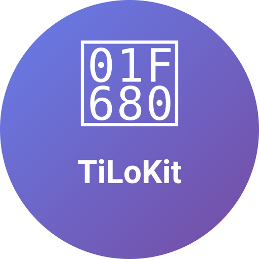
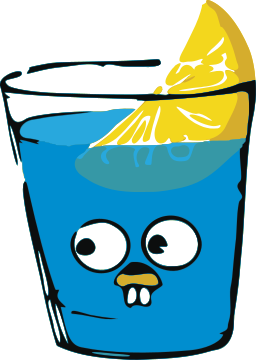
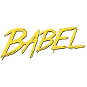
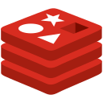
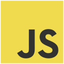
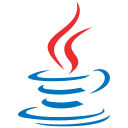
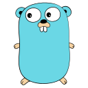
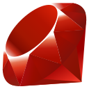
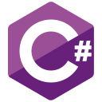

# ✨ TiLoKit – Universal Multi-Framework Project Generator

<p align="center">
  
</p>

<p align="center">
  <a href="https://go.dev/dl/">
    
  </a>
  <a href="../LICENSE">
    
  </a>
  <a href="https://github.com/tienld-0801/tilokit/releases">
    
  </a>
  <a href="https://github.com/tienld-0801/tilokit/actions">
    
  </a>
</p>

<!-- Frameworks Row -->
<p align="center">
  
  
  
  
  
  
  
  
  
  
  
  
  
  
  
  
  
  
  
  
  
  
  
</p>

<!-- Build Tools Row -->
<p align="center">
  
  
  
  
  
  
  
  
  
  
  
  
</p>

<!-- Database Row -->
<p align="center">
  
  
  
  
  
</p>

> 🚀 **Production Ready**: TiLoKit is a powerful, production-ready CLI tool for bootstrapping projects across multiple programming languages and frameworks.
>
> **TiLoKit** - The Universal Multi-Framework Project Generator that developers love. Generate React, Vue, Laravel, Django, Spring Boot, and many more framework projects with a single command. Built with Go for speed and reliability.
>
> **Keywords**: `project generator`, `cli tool`, `scaffold`, `boilerplate`, `react generator`, `vue cli`, `laravel installer`, `django starter`, `spring boot cli`, `go cli`, `multi-framework`, `developer tools`

---

## 🚀 Features

### 🏗️ **Universal Architecture**
- ✅ **Multi-framework support** - React, Vue, Laravel, Django, Spring Boot, and more
- ✅ **Smart CLI interface** - Interactive and command-line modes
- ✅ **Cross-platform** - Works on Linux, macOS, and Windows
- ✅ **Fast & reliable** - Built with Go for optimal performance

### ✅ **Supported Frameworks**

#### **Frontend Frameworks**
-  **React** - TypeScript, Vite, modern tooling
-  **Vue** - Vue 3, Composition API, Pinia

#### **Backend Frameworks**
-  **Django** - Python web framework
-  **Flask** - Lightweight Python framework
-  **FastAPI** - Modern Python API framework
-  **Laravel** - PHP web framework
-  **Symfony** - PHP enterprise framework
-  **CakePHP** - PHP framework
-  **CodeIgniter** - PHP lightweight framework
-  **Spring Boot** - Java enterprise framework
-  **Quarkus** - Cloud-native Java framework
-  **Gin** - Go web framework
-  **Echo** - Go web framework
-  **Fiber** - Go web framework
-  **Rails** - Ruby web framework

#### **More Frontend Frameworks**
-  **Svelte** - SvelteKit, TypeScript support
-  **Angular** - CLI integration, TypeScript
-  **Next.js** - App Router, full-stack
-  **Nuxt** - Vue-based full-stack

#### **Node.js Frameworks**
-  **Express** - Fast, unopinionated web framework
-  **Fastify** - High performance web framework
-  **NestJS** - Progressive Node.js framework

#### **More Backend Frameworks**
-  **Rust** - Actix, Rocket, Axum
-  **C#** - ASP.NET Core, Blazor

#### **Mobile Development**
-  **Flutter** - Dart-based mobile development
-  **iOS** - Swift, SwiftUI *(Coming Soon)*
-  **Android** - Kotlin, Jetpack Compose *(Coming Soon)*

#### **Desktop Applications**
-  **Electron** - Cross-platform desktop
-  **Tauri** - Rust-based desktop *(Coming Soon)*
-  **WPF/WinUI** - Windows desktop *(Coming Soon)*
-  **GTK** - Linux desktop *(Coming Soon)*
-  **macOS** - SwiftUI *(Coming Soon)*
-  **Windows** - WPF/WinUI *(Coming Soon)*

---

## 📦 Installation

### 🚀 **Quick Install Script**
```bash
# Download and verify install script first
curl -fsSLo install.sh https://tienld-0801.github.io/tilokit/install.sh
# Verify checksum against the value published in Releases:
# macOS: shasum -a 256 install.sh
# Linux: sha256sum install.sh
# Compare against the checksum published in the corresponding Release, then:
bash install.sh

# Install specific version
curl -fsSLo install.sh https://tienld-0801.github.io/tilokit/install.sh
# Verify checksum, then:
bash install.sh v0.2.8-dev
```

### 📥 **Manual Installation**

#### **Pre-built Binaries**
Download from [GitHub Releases](https://github.com/tienld-0801/tilokit/releases):
-  **Linux** (x64, ARM64)
-  **macOS** (Intel, Apple Silicon)
-  **Windows** (x64, ARM64)

#### **Build from Source**
```bash
# Requires Go 1.25.0+
go install github.com/tienld-0801/tilokit@latest

# Add $GOPATH/bin (or $HOME/go/bin) to your PATH if needed:
# bash/zsh: echo 'export PATH="$HOME/go/bin:$PATH"' >> ~/.bashrc  # or ~/.zshrc +source ~/.bashrc
# fish: set -Ux PATH $HOME/go/bin $PATH
```

### 🔍 **Verify Installation**
```bash
tilokit -v
# Output: TiLoKit v0.2.8-dev
```

---

### 🚀 **Interactive Mode** (Recommended)
```bash
# Start interactive project generation
tilokit -i
# or
tilokit --init

# Follow the interactive prompts to:
# 1. Choose your framework (React, Vue, Laravel, Django, etc.)
# 2. Select build tools (Vite, Webpack, Composer, etc.)
# 3. Configure project settings
# 4. Generate your project instantly!
```

### 📋 **CLI Commands**
```bash
# Show version information
tilokit -v
tilokit --version

# List all supported frameworks
tilokit -l
tilokit --list-frameworks

# List all supported build tools
tilokit -t
tilokit --list-build-tools

# Update TiLoKit to latest version
tilokit -u
tilokit --update

# Show help
tilokit --help
```

### ⚡ **Quick Project Generation**
```bash
# Frontend Frameworks
tilokit -i -n my-react-app -f react -b vite
tilokit -i -n my-vue-app -f vue -b vite

# Node.js Backend Frameworks
tilokit -i -n my-express-api -f express
tilokit -i -n my-fastify-api -f fastify
tilokit -i -n my-nest-api -f nest

# PHP Frameworks
tilokit -i -n my-laravel-api -f laravel -b composer
tilokit -i -n my-symfony-api -f symfony -b composer
tilokit -i -n my-cakephp-api -f cakephp -b composer
tilokit -i -n my-codeigniter-api -f codeigniter -b composer

# Python Frameworks
tilokit -i -n my-django-api -f django -b pip
tilokit -i -n my-flask-api -f flask -b pip
tilokit -i -n my-fastapi-api -f fastapi -b pip

# Java Frameworks
tilokit -i -n my-springboot-api -f spring-boot -b maven
tilokit -i -n my-quarkus-api -f quarkus -b maven

# Go Frameworks
tilokit -i -n my-gin-api -f gin -b go-modules
tilokit -i -n my-echo-api -f echo -b go-modules
tilokit -i -n my-fiber-api -f fiber -b go-modules

# Ruby Frameworks
tilokit -i -n my-rails-api -f rails -b bundler
```

### 🎛️ **Available Flags**
- `-i, --init` - Initialize new project (with beautiful banner)
- `-n, --name` - Project name
- `-f, --framework` - Framework to use
- `-b, --build-tool` - Build tool preference
- `-o, --output` - Output directory
- `-q, --quiet` - Quiet mode (minimal output)
- `-F, --force` - Force overwrite existing directory
- `-l, --list-frameworks` - List all supported frameworks
- `-t, --list-build-tools` - List all supported build tools
- `-v, --version` - Show version information
- `-u, --update` - Update TiLoKit to the latest version

---

### 🎯 **Supported Frameworks**
Currently supported frameworks include:
- **Frontend**: React, Vue, Svelte, Angular, Next.js, Nuxt
- **Backend**: Django, Flask, FastAPI, Laravel, Symfony, CakePHP, CodeIgniter, Spring Boot
- **Node.js**: Express, Fastify, NestJS
- **Go**: Gin, Echo, Fiber
- **Ruby**: Rails
- **Mobile**: React Native (Expo), Flutter
- **Desktop**: Electron
- **C#**: ASP.NET Core
- **Kotlin**: Spring Boot

### 🔧 **Build Tools**
Supported build tools:
- **Frontend**: Vite, Webpack, Rollup
- **Python**: pip, poetry, pipenv
- **PHP**: Composer
- **Java/Kotlin**: Maven, Gradle
- **Go**: Go modules
- **Ruby**: Bundler
- **Node.js**: npm, yarn, pnpm
- **Mobile**: Expo CLI, Flutter CLI
- **C#**: dotnet CLI

---

### 🎯 **Framework Support**
#### **Currently Supported**
-   **JavaScript/TypeScript** - React, Vue, Svelte, Angular, Next.js, Nuxt, Express, Fastify, NestJS
-  **Python** - Django, Flask, FastAPI
-  **PHP** - Laravel, Symfony, CakePHP, CodeIgniter
-  **Java/Kotlin** - Spring Boot
-  **Go** - Gin, Echo, Fiber
-  **Ruby** - Rails
- 📱 **Mobile** - React Native (Expo), Flutter
- 🖥️ **Desktop** - Electron
-  **C#** - ASP.NET Core

#### **Build System Integration**
-  **Vite** - Fast frontend build tool
-  **Webpack** - Module bundler
-  **Rollup** - ES module bundler
-  **Poetry** - Python dependency management
-  **Composer** - PHP dependency manager
-  **Maven** - Java build automation
-  **Gradle** - Build automation tool
-  **Go modules** - Go dependency management

### 🚀 **Performance Features**
- ⚡ **Fast project generation** - Optimized templates
- 🎯 **Smart defaults** - Best practices built-in
- 🔄 **Cross-platform** - Works on Linux, macOS, Windows
- 📦 **Minimal dependencies** - Single binary installation

---

## 🔍 **SEO & Discoverability**

### 🏷️ **Keywords & Tags**
TiLoKit is optimized for developers searching for:
- `project generator cli` - Universal project scaffolding tool
- `react generator` - Fast React project creation
- `vue cli alternative` - Modern Vue project setup
- `laravel installer` - PHP Laravel project generator
- `django starter` - Python Django project scaffolding
- `spring boot cli` - Java Spring Boot project creation
- `go project generator` - Golang project scaffolding
- `multi framework cli` - Cross-language development tool
- `developer productivity` - Speed up project initialization
- `boilerplate generator` - Eliminate repetitive setup

### 🎯 **Use Cases**
- **Frontend Developers**: Generate React, Vue, Angular, Svelte projects instantly
- **Backend Developers**: Create Laravel, Django, Spring Boot, Go APIs quickly
- **Full-stack Developers**: Bootstrap complete applications with best practices
- **DevOps Engineers**: Standardize project structures across teams
- **Students & Learners**: Get started with any framework using proper setup
- **Enterprise Teams**: Maintain consistent project templates

### 🌟 **Why Choose TiLoKit?**
- ⚡ **Fastest Setup**: Generate projects in seconds, not hours
- 🎯 **Best Practices**: Industry-standard configurations built-in
- 🔄 **Cross-Platform**: Works on Linux, macOS, Windows
- 📦 **Zero Dependencies**: Single binary, no complex installations
- 🚀 **Production Ready**: Battle-tested templates and configurations
- 🔧 **Extensible**: Easy to add new frameworks and tools

---

## 🤝 **Contributing**

<a href="https://github.com/tienld-0801">
  
</a>
<a href="https://github.com/tienld-tgl">
  
</a>
<a href="https://github.com/hoangsinh0601">
  
</a>

### 🌟 **How to Contribute**
We welcome contributions from the developer community!

💬 **Join our Discord community**: [Discord](https://discord.gg/BqTqZ46uT9) to discuss ideas, get help, and collaborate with other contributors.

```bash
# Fork and clone the repository
git clone https://github.com/tienld-0801/tilokit.git
cd tilokit

# Install dependencies
go mod download

# Build from source
go build -o tilokit

# Run tests
go test ./...
```

### 📋 **Contribution Areas**
- 🔧 **New Framework Support** - Add support for more frameworks
- 🐛 **Bug Fixes** - Help us improve stability
- 📚 **Documentation** - Improve guides and examples
- 🧪 **Testing** - Add test coverage
- 🎨 **Templates** - Create better project templates
- 🌍 **Internationalization** - Multi-language support

### 📝 **Development Guidelines**
- Follow [Conventional Commits](https://conventionalcommits.org/)
- Use Go 1.25.0+ for development
- All PRs must pass CI/CD checks
- Add tests for new features
- Update documentation as needed

---

## 📊 **Project Stats & Community**

### 🏆 **GitHub Stats**
- ⭐ **Stars**: Growing developer community
- 🍴 **Forks**: Active contributor base
- 📦 **Releases**: Regular updates and improvements
- 🐛 **Issues**: Community-driven bug reports and feature requests

### 🌐 **Community Links**
- 💬 **Discord Community**: [Discord](https://discord.gg/BqTqZ46uT9) - Get help, share projects, and connect with other developers
- 📖 **Documentation**: [GitHub Wiki](https://github.com/tienld-0801/tilokit/wiki)
- 🐛 **Bug Reports**: [GitHub Issues](https://github.com/tienld-0801/tilokit/issues)
- 💡 **Feature Requests**: [GitHub Discussions](https://github.com/tienld-0801/tilokit/discussions)
- 📦 **Releases**: [GitHub Releases](https://github.com/tienld-0801/tilokit/releases)
- 🔧 **Source Code**: [GitHub Repository](https://github.com/tienld-0801/tilokit)

### 📈 **Roadmap**
- 🔜 **v0.2.0**: More framework support (Rust, C#, Flutter)
- 🔜 **Plugin System**: Community-driven extensions
- 🔜 **Template Marketplace**: Share and discover templates
- 🔜 **IDE Integration**: VSCode, IntelliJ plugins
- 🔜 **Docker Support**: Containerized development environments

### 🙏 **Acknowledgments**
- Built with ❤️ using [Go](https://golang.org/)
- CLI framework powered by [Cobra](https://github.com/spf13/cobra)
- Configuration management with [Viper](https://github.com/spf13/viper)
- Interactive prompts via [Survey](https://github.com/AlecAivazis/survey)
- Colorful output with [Fatih Color](https://github.com/fatih/color)

---

## 📜 **TiLoKit License**
TiLoKit is licensed under a Custom License by Le Duy Tien. See [LICENSE](../LICENSE) for details.

```
TILOKIT LICENSE – LE DUY TIEN
Copyright (c) 2025 Le Duy Tien. All Rights Reserved.

✅ Permitted: View, use, modify for non-commercial purposes, fork & contribute
❌ Prohibited: Commercial use, selling, integrating into commercial products
📝 Derivative works must remain under this license for non-commercial use only
```
