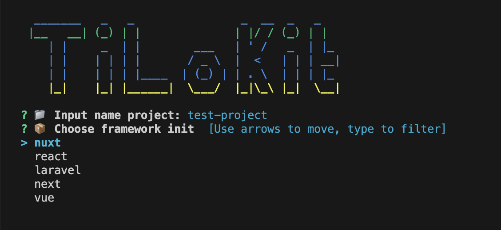

# ✨ TiLoKit – Lightweight Multi-Framework Project Scaffold Generator

  

> ⚠️ **Notice**: TiLoKit is currently under active development. The API and features may change frequently.
> Contributions are welcome as we move toward a stable release. Stay tuned for updates!

---

> **TiLoKit** is a simple and extensible CLI tool for bootstrapping new projects across multiple frameworks such as React, Laravel, and more.
> Whether you're a solo developer or a team, TiLoKit helps you kickstart your workflow with well-structured project scaffolding—fast.

---

## 🚀 Features

- ⚡ Instant project generation with a single CLI command
- 🧱 Supports multiple frontend/backend frameworks (React, Vue, Angular, Next, Nuxt, Laravel, etc.)
- 🤖 Interactive mode via prompts or direct CLI flags
- 🔌 Easily extendable to support custom templates
- 📦 Designed with development and production modes
- 💡 Written in Go for high performance and easy cross-platform support

---

## 📦 Installation

> Coming soon.
> You will be able to install via `go install`, Homebrew, or download a prebuilt binary.

---
