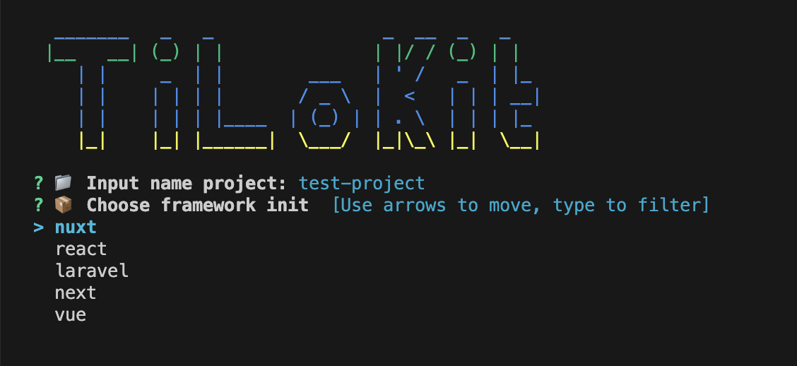

# ✨ TiLoKit – Universal Multi-Framework Project Generator

<p align="left">
  
</p>

[](https://golang.org/dl/)
[](./LICENSE)
[](https://github.com/ti-lo/tilokit/releases)
[](https://github.com/ti-lo/tilokit/actions)

> 🚀 **Production Ready**: TiLoKit is a powerful, production-ready CLI tool for bootstrapping projects across multiple programming languages and frameworks.
>
> **TiLoKit** - The Universal Multi-Framework Project Generator that developers love. Generate React, Vue, Laravel, Django, Spring Boot, and many more framework projects with a single command. Built with Go for speed and reliability.
>
> **Keywords**: `project generator`, `cli tool`, `scaffold`, `boilerplate`, `react generator`, `vue cli`, `laravel installer`, `django starter`, `spring boot cli`, `go cli`, `multi-framework`, `developer tools`

---

## 🚀 Features

### 🏗️ **Universal Architecture**
- ✅ **Multi-framework support** - React, Vue, Laravel, Django, Spring Boot, and more
- ✅ **Smart CLI interface** - Interactive and command-line modes
- ✅ **Cross-platform** - Works on Linux, macOS, and Windows
- ✅ **Fast & reliable** - Built with Go for optimal performance

### 🌐 **Currently Supported Frameworks**

#### **Frontend Frameworks**
- ⚛️ **React** - TypeScript, Vite, modern tooling *(Coming Soon)*
- 🟢 **Vue** - Vue 3, Composition API, Pinia *(Coming Soon)*
- 🔥 **Svelte** - SvelteKit, TypeScript *(Coming Soon)*
- 🅰️ **Angular** - CLI integration, TypeScript *(Coming Soon)*
- ⚡ **Next.js** - App Router, full-stack *(Coming Soon)*
- 💚 **Nuxt** - Vue-based full-stack *(Coming Soon)*

#### **Backend Frameworks**
- 🐘 **Laravel** - PHP web framework *(Coming Soon)*
- 🟢 **Node.js** - Express, Fastify, NestJS *(Coming Soon)*
- 🐍 **Python** - Django, Flask, FastAPI *(Coming Soon)*
- 🦀 **Rust** - Actix, Rocket, Axum *(Coming Soon)*
- ☕ **Java** - Spring Boot, Quarkus *(Coming Soon)*
- 💎 **Ruby** - Rails, Sinatra *(Coming Soon)*
- 🔷 **C#** - ASP.NET Core, Blazor *(Coming Soon)*
- 🐹 **Go** - Gin, Echo, Fiber *(Coming Soon)*

#### **Mobile Development**
- 📱 **React Native** - Cross-platform mobile *(Coming Soon)*
- 💙 **Flutter** - Dart-based mobile *(Coming Soon)*
- 🍎 **iOS** - Swift, SwiftUI *(Coming Soon)*
- 🤖 **Android** - Kotlin, Jetpack Compose *(Coming Soon)*

#### **Desktop Applications**
- 🖥️ **Electron** - Cross-platform desktop *(Coming Soon)*
- 🦀 **Tauri** - Rust-based desktop *(Coming Soon)*
- 🔷 **WPF/WinUI** - Windows desktop *(Coming Soon)*
- 🐧 **GTK** - Linux desktop *(Coming Soon)*

---

## 📦 Installation

### 🚀 **Quick Install Script**
```bash
# Install latest version (Linux/macOS)
curl -fsSL https://ti-lo.github.io/tilokit/install.sh | bash

# Install specific version
curl -fsSL https://ti-lo.github.io/tilokit/install.sh | bash -s v0.1.3-dev
```

### 📥 **Manual Installation**

#### **Pre-built Binaries**
Download from [GitHub Releases](https://github.com/ti-lo/tilokit/releases):
- 🐧 **Linux** (x64, ARM64)
- 🍎 **macOS** (Intel, Apple Silicon)
- 🪟 **Windows** (x64, ARM64)

#### **Build from Source**
```bash
# Requires Go 1.24.5+
go install github.com/ti-lo/tilokit@latest
```

### 🔍 **Verify Installation**
```bash
tilokit -v
# Output: TiLoKit v0.1.3-dev
```

---

## 🎯 Usage

### 🚀 **Interactive Mode** (Recommended)
```bash
# Start interactive project generation
tilokit -i
# or
tilokit --init

# Follow the interactive prompts to:
# 1. Choose your framework (React, Vue, Laravel, Django, etc.)
# 2. Select build tools (Vite, Webpack, Composer, etc.)
# 3. Configure project settings
# 4. Generate your project instantly!
```

### 📋 **CLI Commands**
```bash
# Show version information
tilokit -v
tilokit --version

# List all supported frameworks
tilokit -l
tilokit --list-frameworks

# List all supported build tools
tilokit -t
tilokit --list-build-tools

# Update TiLoKit to latest version
tilokit -u
tilokit --update

# Show help
tilokit --help
```

### ⚡ **Quick Project Generation**
```bash
# Create React project with Vite
tilokit -i -n my-react-app -f react -b vite

# Create Vue project
tilokit -i -n my-vue-app -f vue -b vite

# Create Laravel project
tilokit -i -n my-api -f laravel -b composer

# Create Django project
tilokit -i -n my-python-api -f django -b pip

# Create Spring Boot project
tilokit -i -n my-java-api -f spring-boot -b maven

# Create Go project with Gin
tilokit -i -n my-go-api -f gin -b go-modules
```

### 🎛️ **Available Flags**
- `-i, --init` - Initialize new project (with beautiful banner)
- `-n, --name` - Project name
- `-f, --framework` - Framework to use
- `-b, --build-tool` - Build tool preference
- `-o, --output` - Output directory
- `-q, --quiet` - Quiet mode (minimal output)
- `-F, --force` - Force overwrite existing directory

---

## ⚙️ Configuration

### 📝 **Configuration File**
TiLoKit uses a simple YAML configuration file located at:
```
./config/tilokit.yaml
```

### 🎯 **Supported Frameworks**
Currently supported frameworks include:
- **Frontend**: React, Vue, Svelte, Angular, Next.js, Nuxt
- **Backend**: Django, Flask, FastAPI, Laravel, Symfony, Spring Boot, Quarkus
- **Go**: Gin, Echo, Fiber
- **Ruby**: Rails

### 🔧 **Build Tools**
Supported build tools:
- **Frontend**: Vite, Webpack, npm, yarn, pnpm
- **Backend**: pip, composer, maven, gradle, bundler, go-modules

---

## 🏗️ Architecture

### 🎯 **Framework Support**
TiLoKit is built with a modular architecture supporting multiple programming languages and frameworks:

#### **Currently Supported**
- 🟨 **JavaScript/TypeScript** - React, Vue, Svelte, Angular, Next.js, Nuxt
- 🐍 **Python** - Django, Flask, FastAPI
- 🐘 **PHP** - Laravel, Symfony
- ☕ **Java** - Spring Boot, Quarkus
- 🐹 **Go** - Gin, Echo, Fiber
- 💎 **Ruby** - Rails

#### **Build System Integration**
- 🔧 **Frontend**: Vite, Webpack, npm, yarn, pnpm
- 🐍 **Python**: pip, poetry, pipenv
- 🐘 **PHP**: Composer
- ☕ **Java**: Maven, Gradle
- 🐹 **Go**: Go modules
- 💎 **Ruby**: Bundler

### 🚀 **Performance Features**
- ⚡ **Fast project generation** - Optimized templates
- 🎯 **Smart defaults** - Best practices built-in
- 🔄 **Cross-platform** - Works on Linux, macOS, Windows
- 📦 **Minimal dependencies** - Single binary installation

---

## 🔍 **SEO & Discoverability**

### 🏷️ **Keywords & Tags**
TiLoKit is optimized for developers searching for:
- `project generator cli` - Universal project scaffolding tool
- `react generator` - Fast React project creation
- `vue cli alternative` - Modern Vue project setup
- `laravel installer` - PHP Laravel project generator
- `django starter` - Python Django project scaffolding
- `spring boot cli` - Java Spring Boot project creation
- `go project generator` - Golang project scaffolding
- `multi framework cli` - Cross-language development tool
- `developer productivity` - Speed up project initialization
- `boilerplate generator` - Eliminate repetitive setup

### 🎯 **Use Cases**
- **Frontend Developers**: Generate React, Vue, Angular, Svelte projects instantly
- **Backend Developers**: Create Laravel, Django, Spring Boot, Go APIs quickly
- **Full-stack Developers**: Bootstrap complete applications with best practices
- **DevOps Engineers**: Standardize project structures across teams
- **Students & Learners**: Get started with any framework using proper setup
- **Enterprise Teams**: Maintain consistent project templates

### 🌟 **Why Choose TiLoKit?**
- ⚡ **Fastest Setup**: Generate projects in seconds, not hours
- 🎯 **Best Practices**: Industry-standard configurations built-in
- 🔄 **Cross-Platform**: Works on Linux, macOS, Windows
- 📦 **Zero Dependencies**: Single binary, no complex installations
- 🚀 **Production Ready**: Battle-tested templates and configurations
- 🔧 **Extensible**: Easy to add new frameworks and tools

---

## 🤝 **Contributing**

### 🌟 **How to Contribute**
We welcome contributions from the developer community!

```bash
# Fork and clone the repository
git clone https://github.com/ti-lo/tilokit.git
cd tilokit

# Install dependencies
go mod download

# Build from source
go build -o tilokit

# Run tests
go test ./...
```

### 📋 **Contribution Areas**
- 🔧 **New Framework Support** - Add support for more frameworks
- 🐛 **Bug Fixes** - Help us improve stability
- 📚 **Documentation** - Improve guides and examples
- 🧪 **Testing** - Add test coverage
- 🎨 **Templates** - Create better project templates
- 🌍 **Internationalization** - Multi-language support

### 📝 **Development Guidelines**
- Follow [Conventional Commits](https://conventionalcommits.org/)
- Use Go 1.24.5+ for development
- All PRs must pass CI/CD checks
- Add tests for new features
- Update documentation as needed

---

## 📊 **Project Stats & Community**

### 🏆 **GitHub Stats**
- ⭐ **Stars**: Growing developer community
- 🍴 **Forks**: Active contributor base
- 📦 **Releases**: Regular updates and improvements
- 🐛 **Issues**: Community-driven bug reports and feature requests

### 🌐 **Community Links**
- 📖 **Documentation**: [GitHub Wiki](https://github.com/ti-lo/tilokit/wiki)
- 🐛 **Bug Reports**: [GitHub Issues](https://github.com/ti-lo/tilokit/issues)
- 💡 **Feature Requests**: [GitHub Discussions](https://github.com/ti-lo/tilokit/discussions)
- 📦 **Releases**: [GitHub Releases](https://github.com/ti-lo/tilokit/releases)
- 🔧 **Source Code**: [GitHub Repository](https://github.com/ti-lo/tilokit)

### 📈 **Roadmap**
- 🔜 **v0.2.0**: More framework support (Rust, C#, Flutter)
- 🔜 **Plugin System**: Community-driven extensions
- 🔜 **Template Marketplace**: Share and discover templates
- 🔜 **IDE Integration**: VSCode, IntelliJ plugins
- 🔜 **Docker Support**: Containerized development environments

---

## 📄 **License & Legal**

### 📜 **MIT License**
TiLoKit is open-source software licensed under the [MIT License](./LICENSE).

```
Copyright (c) 2024 TiLoKit Contributors

Permission is hereby granted, free of charge, to any person obtaining a copy
of this software and associated documentation files (the "Software"), to deal
in the Software without restriction, including without limitation the rights
to use, copy, modify, merge, publish, distribute, sublicense, and/or sell
copies of the Software, and to permit persons to whom the Software is
furnished to do so, subject to the following conditions:

The above copyright notice and this permission notice shall be included in all
copies or substantial portions of the Software.
```

### 🙏 **Acknowledgments**
- Built with ❤️ using [Go](https://golang.org/)
- CLI framework powered by [Cobra](https://github.com/spf13/cobra)
- Configuration management with [Viper](https://github.com/spf13/viper)
- Interactive prompts via [Survey](https://github.com/AlecAivazis/survey)
- Colorful output with [Fatih Color](https://github.com/fatih/color)

---

<div align="center">

## 🚀 **Ready to boost your development productivity?**

### Install TiLoKit now and generate your next project in seconds

```bash
curl -fsSL https://ti-lo.github.io/tilokit/install.sh | bash
```

**[⬇️ Download](https://github.com/ti-lo/tilokit/releases) • [📖 Documentation](https://github.com/ti-lo/tilokit/wiki) • [🐛 Report Issues](https://github.com/ti-lo/tilokit/issues) • [💡 Discussions](https://github.com/ti-lo/tilokit/discussions)**

---

### Made with ❤️ by developers, for developers

**TiLoKit** - *The Universal Multi-Framework Project Generator*

</div>
