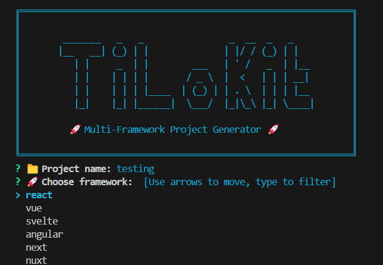

# ✨ TiLoKit – Universal Multi-Framework Project Generator

<p align="left">
  
</p>

[](https://golang.org/dl/)
[](./LICENSE)
[](https://golang.org/dl/)

> ⚠️ **Development Status**: TiLoKit is currently under active development. Features and API may change.
>
> **TiLoKit** is a universal CLI tool for bootstrapping projects across multiple programming languages and frameworks.
> From web development to mobile apps, desktop applications to backend services - TiLoKit aims to support them all.

---

## 🚀 Planned Features

### 🏗️ **Universal Architecture**
- 🔌 **Plugin-based system** - Support for any language/framework
- ⚡ **Multi-language support** - JavaScript, Python, Go, Rust, Java, C#, PHP, Ruby, and more
- 🎯 **Smart templates** - Best practices for each technology stack
- 🔄 **Extensible design** - Easy to add new frameworks and tools

### 🌐 **Planned Framework Support**

#### **Frontend Frameworks**
- ⚛️ **React** - TypeScript, Vite, modern tooling *(Coming Soon)*
- 🟢 **Vue** - Vue 3, Composition API, Pinia *(Coming Soon)*
- 🔥 **Svelte** - SvelteKit, TypeScript *(Coming Soon)*
- 🅰️ **Angular** - CLI integration, TypeScript *(Coming Soon)*
- ⚡ **Next.js** - App Router, full-stack *(Coming Soon)*
- 💚 **Nuxt** - Vue-based full-stack *(Coming Soon)*

#### **Backend Frameworks**
- 🐘 **Laravel** - PHP web framework *(Coming Soon)*
- 🟢 **Node.js** - Express, Fastify, NestJS *(Coming Soon)*
- 🐍 **Python** - Django, Flask, FastAPI *(Coming Soon)*
- 🦀 **Rust** - Actix, Rocket, Axum *(Coming Soon)*
- ☕ **Java** - Spring Boot, Quarkus *(Coming Soon)*
- 💎 **Ruby** - Rails, Sinatra *(Coming Soon)*
- 🔷 **C#** - ASP.NET Core, Blazor *(Coming Soon)*
- 🐹 **Go** - Gin, Echo, Fiber *(Coming Soon)*

#### **Mobile Development**
- 📱 **React Native** - Cross-platform mobile *(Coming Soon)*
- 💙 **Flutter** - Dart-based mobile *(Coming Soon)*
- 🍎 **iOS** - Swift, SwiftUI *(Coming Soon)*
- 🤖 **Android** - Kotlin, Jetpack Compose *(Coming Soon)*

#### **Desktop Applications**
- 🖥️ **Electron** - Cross-platform desktop *(Coming Soon)*
- 🦀 **Tauri** - Rust-based desktop *(Coming Soon)*
- 🔷 **WPF/WinUI** - Windows desktop *(Coming Soon)*
- 🐧 **GTK** - Linux desktop *(Coming Soon)*

---

## 📦 Installation

> ⚠️ **Coming Soon**: TiLoKit is currently in development. Installation methods will be available upon release.

### Planned Installation Methods
- 📦 **Pre-built binaries** for Linux, macOS, Windows
- 🍺 **Homebrew** for macOS and Linux
- 🐳 **Docker** containers
- 📥 **Package managers** (apt, yum, chocolatey)
- 🔧 **Go install** for developers

---

## 🎯 Usage

### Interactive Mode
```bash
# Start interactive project generation
tilokit -i
# or
tilokit --init

# Choose from multiple categories:
# 1. Frontend (React, Vue, Angular, Svelte...)
# 2. Backend (Laravel, Django, Spring Boot...)
# 3. Mobile (React Native, Flutter...)
# 4. Desktop (Electron, Tauri...)
# 5. Full-stack (Next.js, Nuxt, T3 Stack...)
```

### CLI Commands
```bash
# Show version
tilokit -v

# List supported frameworks
tilokit -l

# List supported build tools
tilokit -t

# Update TiLoKit
tilokit -u
```

### Quick Commands
```bash
# Frontend projects
tilokit -i -n my-app -f react -b vite
tilokit -i -n my-vue-app -f vue -b vite

# Backend projects
tilokit -i -n my-api -f laravel -b composer
tilokit -i -n my-python-api -f django -b pip

# Mobile projects
tilokit -i -n my-mobile-app -f react-native
tilokit -i -n my-flutter-app -f flutter

# Full-stack projects
tilokit -i -n my-fullstack-app -f nextjs
```

---

## ⚙️ Configuration

> ⚠️ **Coming Soon**: Configuration system is under development.

### Planned Configuration Features
- 📝 **YAML-based configuration** for default settings
- 🎯 **Per-project templates** and customizations
- 🔧 **Global preferences** for package managers, testing frameworks
- 🎨 **Custom templates** support
- 🌍 **Environment-specific** configurations

---

## 🔌 Plugin Architecture

> ⚠️ **Coming Soon**: Plugin system is under development.

### Planned Plugin Categories

#### **Language Plugins**
- 🟨 **JavaScript/TypeScript** - Node.js ecosystem
- 🐍 **Python** - Django, Flask, FastAPI
- 🐘 **PHP** - Laravel, Symfony, CodeIgniter
- ☕ **Java** - Spring, Quarkus, Micronaut
- 🦀 **Rust** - Actix, Rocket, Axum
- 💎 **Ruby** - Rails, Sinatra
- 🔷 **C#** - ASP.NET, Blazor
- 🐹 **Go** - Gin, Echo, Fiber

#### **Framework Plugins**
- 🌐 **Web Frameworks** - Full-stack and API frameworks
- 📱 **Mobile Frameworks** - Cross-platform and native
- 🖥️ **Desktop Frameworks** - Cross-platform desktop apps
- 🎮 **Game Engines** - Unity, Unreal, Godot

#### **Tool Plugins**
- 🔧 **Build Tools** - Webpack, Vite, Gradle, Maven
- 🧪 **Testing Tools** - Jest, PyTest, PHPUnit
- 📦 **Package Managers** - npm, pip, composer, cargo
- 🐳 **DevOps Tools** - Docker, Kubernetes, CI/CD

---

## 📋 Planned CLI Interface

> ⚠️ **Coming Soon**: CLI interface is under development.

### Planned Commands
```bash
tilokit init              # Interactive project creation
tilokit create            # Direct project creation
tilokit list              # List available frameworks/templates
tilokit update            # Update templates and plugins
tilokit config            # Manage configuration
tilokit plugin            # Manage plugins
tilokit version           # Show version information
```

### Planned Flags
```bash
--type, -t          Project type (frontend, backend, mobile, desktop, fullstack)
--framework, -f     Framework/technology to use
--template          Specific template variant
--output, -o        Output directory
--package-manager   Package manager preference
--git               Initialize git repository
--install           Install dependencies after creation
```

---
